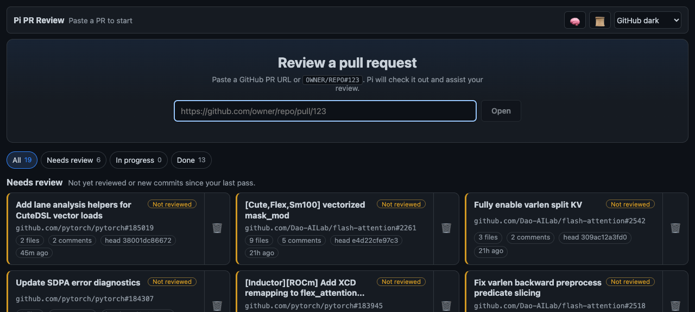
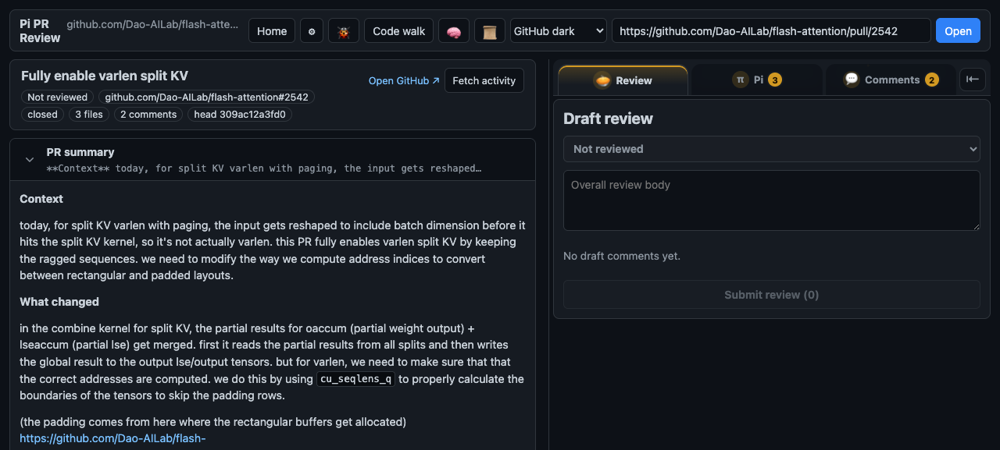
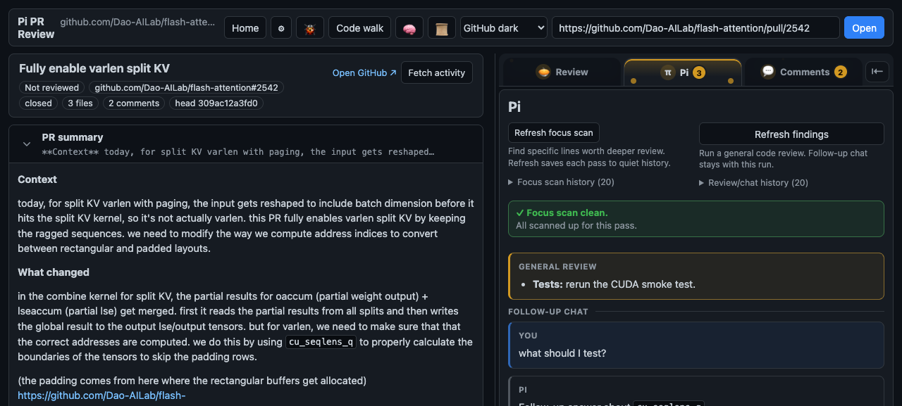
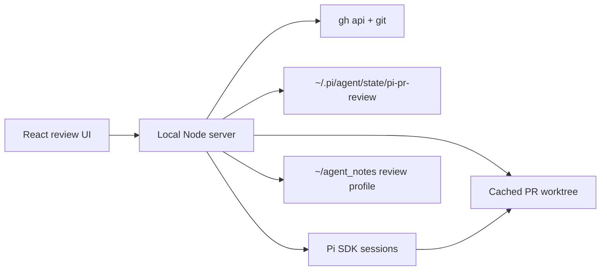

# pi-review

Pi Review is a local PR review cockpit for engineers who want GitHub diffs, draft review comments, and Pi-assisted code review in one focused workspace.

Instead of jumping between GitHub, terminal worktrees, and separate agent chats, paste a PR URL and review from a single app: browse the diff, ask Pi about a line or the whole PR, write draft comments, and submit the review back to GitHub.



## What it feels like

Open a PR and Pi Review lays out the code review flow as a split workspace:

- the left side is a GitHub-style diff with expandable context, viewed-file state, inline threads, and multiline draft ranges
- the right side is the review panel for draft comments, existing GitHub activity, and Pi review sessions
- local state remembers recent PRs, viewed files, draft work, Pi sessions, and reviewer preference memory



Ask Pi can work at multiple levels: an inline question on a selected line/range, a full-PR findings pass, or a focus scan that turns the review into concrete areas to inspect.



## Features

- Open PRs from a GitHub URL or `OWNER/REPO#123`.
- Review GitHub-style unified or split diffs with expandable hunk context.
- Add, edit, remove, and submit draft review comments.
- Select multiline ranges for GitHub review comments.
- Mark files viewed and keep recent PR review status locally.
- Fetch existing GitHub comments and activity.
- Ask Pi about selected lines, focus areas, or the full PR.
- Reuse PR worktrees and Pi sessions across reloads/server restarts.
- Store submitted review examples and distill them into a reviewer profile.

## How it works



The app is intentionally local-first. GitHub access goes through your authenticated `gh` CLI, repositories are cached as local worktrees, and Pi sessions run against the checked-out PR code so answers can reference real files.

## Requirements

- Node.js/npm
- `gh` authenticated for GitHub API access
- `git`
- Pi SDK auth/config already set up for Ask Pi

Check GitHub auth:

```sh
gh auth status
```

## Quick start

From a fresh clone, one command installs dependencies, builds the app, and starts the local server:

```sh
npm start
```

Open http://127.0.0.1:43133.

Or clone and start in one shell command:

```sh
git clone https://github.com/drisspg/pi-review && cd pi-review && npm start
```

`npm start` automatically runs `npm install` when dependencies are missing or stale, runs `npm run build` when the built server/web assets are missing or stale, then starts the production server.

## Development

Run dev mode with file watching:

```sh
npm run dev
```

Open http://127.0.0.1:5173.

Useful commands:

```sh
npm run build
npm run start:built
npm run typecheck
npm run test:e2e
npm run validate
```

The Playwright suite opens a real PR by default. Override it with:

```sh
PI_REVIEW_TEST_PR=https://github.com/OWNER/REPO/pull/123 npm run test:e2e
```

## Local state

State is stored under:

```text
~/.pi/agent/state/pi-pr-review/
```

Important subdirectories:

```text
state.json                 # recent PRs, viewed files, review memory
repos/                     # cached base repos
worktrees/                 # per-PR worktrees
pi-sessions/               # persistent Pi SDK sessions per PR
```

Submitted review comments are captured as raw preference memory in `state.json` and mirrored to:

```text
~/agent_notes/findings/pi_review_preferences.md
```

Distill raw examples into an actionable reviewer profile with:

```sh
curl -X POST http://127.0.0.1:43133/api/review-memory/distill
```

The distilled profile is stored in `state.json`, mirrored to:

```text
~/agent_notes/findings/pi_review_profile.md
```

and included in future Pi Review prompts.

## Project layout

```text
src/       local API server, GitHub integration, worktrees, Pi sessions, state
web/src/   React/Vite review UI
tests/     Playwright end-to-end tests
```
