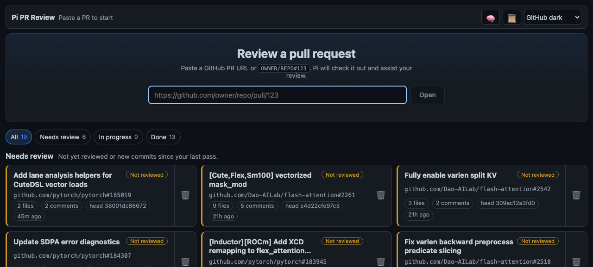
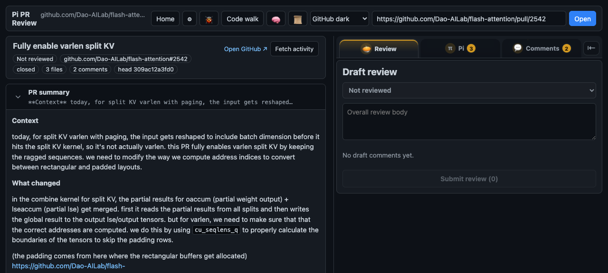
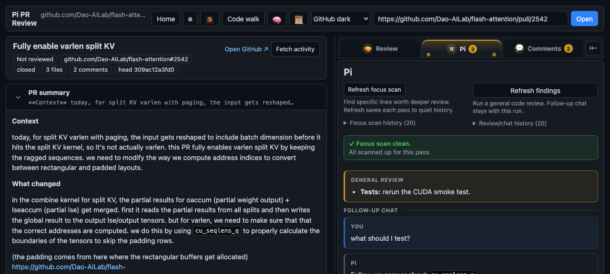
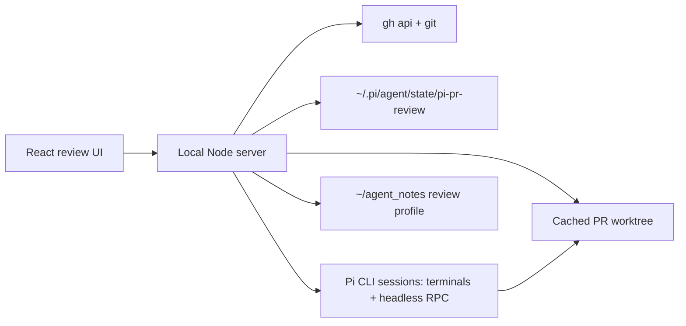

# pi-review

Pi Review is a local PR review cockpit for engineers who want GitHub diffs, draft review comments, and Pi-assisted code review in one focused workspace.

Instead of jumping between GitHub, terminal worktrees, and separate agent chats, paste a PR URL and review from a single app: browse the diff, ask Pi about a line or the whole PR, write draft comments, and submit the review back to GitHub.



## What it feels like

Open a PR and Pi Review lays out the code review flow as a split workspace:

- the left side is a GitHub-style diff with expandable context, viewed-file state, inline threads, and multiline draft ranges
- the right side is the review panel for draft comments, existing GitHub activity, and Pi review sessions
- local state remembers recent PRs, viewed files, draft work, Pi sessions, and reviewer preference memory



Ask Pi can work at multiple levels: an inline question on a selected line/range, a full-PR findings pass, or a focus scan that turns the review into concrete areas to inspect.



## Features

- Open PRs from a GitHub URL or `OWNER/REPO#123`.
- Review GitHub-style unified or split diffs with expandable hunk context.
- Add, edit, remove, and submit draft review comments.
- Select multiline ranges for GitHub review comments.
- Mark files viewed and keep recent PR review status locally.
- Fetch existing GitHub comments and activity.
- Ask Pi about selected lines, focus areas, or the full PR.
- Reuse PR worktrees and Pi sessions across reloads/server restarts.
- Store submitted review examples and distill them into a reviewer profile.
- Re-review with "Since last review": diff only what changed since the head you last reviewed.
- See CI check-run status in the PR header, with failing checks one click away.
- See inline blame context (last commit, author, age, originating PR) when opening a line thread.
- Log feature usage locally (API calls plus key UI actions) to a JSONL file; `npm run usage:report` summarizes what you use, what you don't, and where latency or errors add friction.

## How it works


```mermaid
flowchart LR
  Browser[React review UI] --> Server[Local Node server]
  Server --> GH[gh api + git]
  Server --> State[~/.pi/agent/state/pi-pr-review]
  Server --> Worktree[Cached PR worktree]
  Server --> Pi[Pi CLI sessions: terminals + headless RPC]
  Pi --> Worktree
  Server --> Notes[~/agent_notes review profile]
```

The app is intentionally local-first. GitHub access goes through your authenticated `gh` CLI, repositories are cached as local worktrees, and Pi sessions run against the checked-out PR code so answers can reference real files.

## Requirements

- Node.js/npm
- `gh` authenticated for GitHub API access
- `git`
- Pi CLI installed, with authentication and a default model already configured

Check GitHub auth:

```sh
gh auth status
```

## Quick start

From a fresh clone, one command installs dependencies, builds the app, and starts the local server:

```sh
npm start
```

Open http://127.0.0.1:43133.

Or clone and start in one shell command:

```sh
git clone https://github.com/drisspg/pi-review && cd pi-review && npm start
```

`npm start` automatically runs `npm install` when dependencies are missing or stale, runs `npm run build` when the built server/web assets are missing or stale, then starts the production server.

## Pi launcher and model

Pi Review uses your installed Pi CLI for **both inline terminals and background reviews**. It uses
`PI_REVIEW_PI_COMMAND` when explicitly set, then `piCommand` in the app checkout's gitignored
`.pi-review.local.json`, then `PI_BIN`, then the installed `pi` on PATH. Project-local npm binaries
are excluded from launcher lookup. For a machine-local wrapper, create `.pi-review.local.json`:

```json
{"piCommand": "~/dotfiles/scripts/pi-work"}
```

Both `npm start` and `npm run dev` pick this up automatically. Alternatively, export the wrapper
path once in your shell configuration to share it with Pi Review and other applications:

```sh
export PI_BIN="$HOME/dotfiles/scripts/pi-work"
```

Avoid sourcing an interactive shell per agent just to resolve an alias: prompt plugins can start
detached helper processes. With a configured launcher, Pi Review needs no separate login or
per-thread setup.

The provider/model in your global Pi settings (`~/.pi/agent/settings.json`, or
`PI_CODING_AGENT_DIR`) applies to new review agents, including terminals resumed from older
sessions. Pi Review no longer hardcodes a personal Codex provider. Background reviews refuse a
fallback to a different configured model. Existing running agents keep their model until stopped
or explicitly changed; restarting Pi Review picks up the new launcher for all agents.

To override the shared launcher for Pi Review only, set `PI_REVIEW_PI_COMMAND=/absolute/path/to/pi-wrapper`
before `npm start`. This is an executable path, not a shell command with arguments. Authentication
and transport stay inside that launcher; Pi Review does not copy credentials or reimplement the
work gateway. Server-owned draft/GPU tools are exposed only to their agent over an ephemeral,
token-protected loopback connection.

Review agents receive a bounded workspace brief: PR/snapshot, checkout root, task scope, host,
and environment hints. It makes static review the default, prohibits whole-disk package searches,
and tells agents to report missing dependencies instead of expanding discovery. The same brief is
added to delegated subagent tasks. This is guidance, not a sandbox, and does not cancel already
running work; restart review sessions to pick up new launch context.

The `suggest_change` agent tool accepts exact replacement `code` and creates a private inline
comment using GitHub's `suggestion` block. In a line thread it uses the selected new-file line or
range; otherwise supply `path`, `line`, and optionally `startLine`. Publish the draft normally,
and the PR author can use GitHub's **Apply suggestion** action. The tool does not edit the checkout.

After updating Pi, run `npm run pi:smoke` to exercise a real background response, an in-memory draft
tool, a real terminal response, reconnection, and process cleanup. It uses your configured model
(and therefore incurs model usage), creates no GitHub comments, and removes its temporary sessions.
Run it from your normal terminal; a nested agent sandbox may not allow another sandbox in a new cwd.

## Development

Run dev mode with file watching:

```sh
npm run dev
```

Open http://127.0.0.1:5173.

Useful commands:

```sh
npm run build
npm run start:built
npm run typecheck
npm run test:e2e
npm run validate
```

The Playwright suite opens a real PR by default. Override it with:

```sh
PI_REVIEW_TEST_PR=https://github.com/OWNER/REPO/pull/123 npm run test:e2e
```

## Local state

State is stored under:

```text
~/.pi/agent/state/pi-pr-review/
```

Important subdirectories:

```text
state.json                 # recent PRs, viewed files, review memory
repos/                     # cached base repos
worktrees/                 # per-PR worktrees
pi-sessions/               # background Pi sessions per PR
terminal-sessions/         # resumable native Pi terminal threads
```

Submitted review comments are captured as raw preference memory in `state.json` and mirrored to:

```text
~/agent_notes/findings/pi_review_preferences.md
```

Distill raw examples into an actionable reviewer profile with:

```sh
curl -X POST http://127.0.0.1:43133/api/review-memory/distill
```

The distilled profile is stored in `state.json`, mirrored to:

```text
~/agent_notes/findings/pi_review_profile.md
```

and included in future Pi Review prompts.

## Project layout

```text
src/       local API server, GitHub integration, worktrees, Pi sessions, state
web/src/   React/Vite review UI
tests/     Playwright end-to-end tests
```
