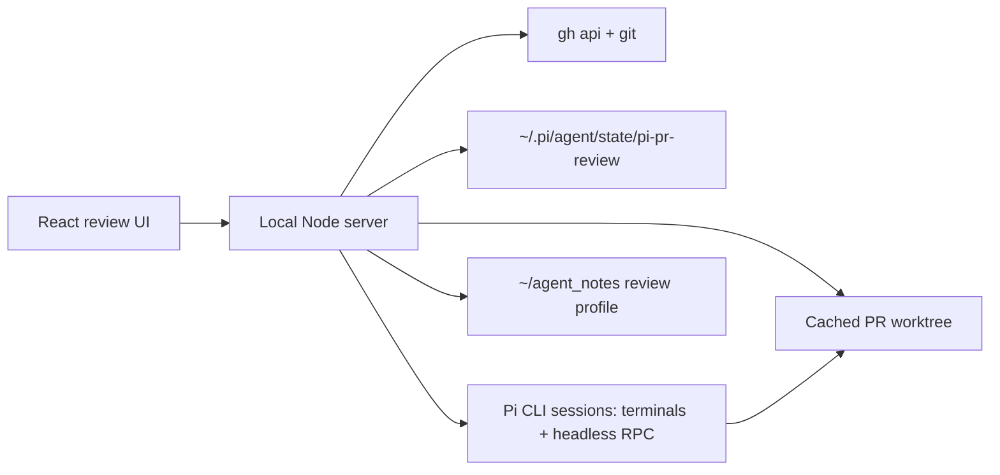

# pi-review

Pi Review is a local PR review cockpit for engineers who want GitHub diffs, draft review comments, and Pi-assisted code review in one focused workspace.

Instead of jumping between GitHub, terminal worktrees, and separate agent chats, paste a PR URL and review from a single app: browse the diff, ask Pi about a line or the whole PR, write draft comments, and submit the review back to GitHub.


## What it feels like

Open a PR and Pi Review lays out the code review flow as a split workspace:

- the left side is a GitHub-style diff with expandable context, viewed-file state, inline threads, and multiline draft ranges
- the right side is the review panel for draft comments, existing GitHub activity, and Pi review sessions
- local state remembers recent PRs, viewed files, draft work, Pi sessions, and reviewer preference memory


Ask Pi can work at multiple levels: an inline question on a selected line/range, a full-PR findings pass, or a focus scan that turns the review into concrete areas to inspect.


## Features

- Open PRs from a GitHub URL or `OWNER/REPO#123`.
- Review GitHub-style unified or split diffs with expandable hunk context.
- Add, edit, remove, and submit draft review comments.
- Select multiline ranges for GitHub review comments.
- Mark files viewed and keep recent PR review status locally.
- Fetch existing GitHub comments and activity.
- Ask Pi about selected lines, focus areas, or the full PR.
- Reuse PR worktrees and Pi sessions across reloads/server restarts.
- Store submitted review examples and distill them into a reviewer profile.
- Re-review with "Since last review": diff only what changed since the head you last reviewed.
- See CI check-run status in the PR header, with failing checks one click away.
- See inline blame context (last commit, author, age, originating PR) when opening a line thread.
- Log feature usage locally (API calls plus key UI actions) to a JSONL file; `npm run usage:report` summarizes what you use, what you don't, and where latency or errors add friction.

## How it works


```mermaid
flowchart LR
  Browser[React review UI] --> Server[Local Node server]
  Server --> GH[gh api + git]
  Server --> State[~/.pi/agent/state/pi-pr-review]
  Server --> Worktree[Cached PR worktree]
  Server --> Pi[Pi CLI sessions: terminals + headless RPC]
  Pi --> Worktree
  Server --> Notes[~/agent_notes review profile]
```

The app is intentionally local-first. GitHub access goes through your authenticated `gh` CLI, repositories are cached as local worktrees, and Pi sessions run against the checked-out PR code so answers can reference real files.

## Requirements

- Node.js/npm
- `gh` authenticated for GitHub API access
- `git`
- Pi CLI installed, with authentication and a default model already configured

Check GitHub auth:

```sh
gh auth status
```

## Quick start

From a fresh clone, one command installs dependencies, builds the app, and starts the local server:

```sh
npm start
```

Open http://127.0.0.1:43133.

Or clone and start in one shell command:

```sh
git clone https://github.com/drisspg/pi-review && cd pi-review && npm start
```

`npm start` automatically runs `npm install` when dependencies are missing or stale, runs `npm run build` when the built server/web assets are missing or stale, then starts the production server.

## Pi launcher and model

Pi Review uses your installed Pi CLI for **both inline terminals and background reviews**. It uses
`PI_REVIEW_PI_COMMAND` when explicitly set, then `piCommand` in the app checkout's gitignored
`.pi-review.local.json`, then `PI_BIN`, then the installed `pi` on PATH. Project-local npm binaries
are excluded from launcher lookup. For a machine-local wrapper, create `.pi-review.local.json`:

```json
{"piCommand": "~/dotfiles/scripts/pi-work"}
```

Both `npm start` and `npm run dev` pick this up automatically. Alternatively, export the wrapper
path once in your shell configuration to share it with Pi Review and other applications:

```sh
export PI_BIN="$HOME/dotfiles/scripts/pi-work"
```

Avoid sourcing an interactive shell per agent just to resolve an alias: prompt plugins can start
detached helper processes. With a configured launcher, Pi Review needs no separate login or
per-thread setup.

The provider/model in your global Pi settings (`~/.pi/agent/settings.json`, or
`PI_CODING_AGENT_DIR`) applies to new review agents, including terminals resumed from older
sessions. Pi Review no longer hardcodes a personal Codex provider. Background reviews refuse a
fallback to a different configured model. Existing running agents keep their model until stopped
or explicitly changed; restarting Pi Review picks up the new launcher for all agents.

To override the shared launcher for Pi Review only, set `PI_REVIEW_PI_COMMAND=/absolute/path/to/pi-wrapper`
before `npm start`. This is an executable path, not a shell command with arguments. Authentication
and transport stay inside that launcher; Pi Review does not copy credentials or reimplement the
work gateway. Server-owned draft/GPU tools are exposed only to their agent over an ephemeral,
token-protected loopback connection.

Review agents receive a bounded workspace brief: PR/snapshot, checkout root, task scope, host,
and environment hints. It makes static review the default, prohibits whole-disk package searches,
and tells agents to report missing dependencies instead of expanding discovery. The same brief is
added to delegated subagent tasks. This is guidance, not a sandbox, and does not cancel already
running work; restart review sessions to pick up new launch context.

The `suggest_change` agent tool accepts exact replacement `code` and creates a private inline
comment using GitHub's `suggestion` block. In a line thread it uses the selected new-file line or
range; otherwise supply `path`, `line`, and optionally `startLine`. Publish the draft normally,
and the PR author can use GitHub's **Apply suggestion** action. The tool does not edit the checkout.

After updating Pi, run `npm run pi:smoke` to exercise a real background response, an in-memory draft
tool, a real terminal response, reconnection, and process cleanup. It uses your configured model
(and therefore incurs model usage), creates no GitHub comments, and removes its temporary sessions.
Run it from your normal terminal; a nested agent sandbox may not allow another sandbox in a new cwd.

## Development

Run dev mode with file watching:

```sh
npm run dev
```

Open http://127.0.0.1:5173.

Useful commands:

```sh
npm run build
npm run start:built
npm run typecheck
npm run test:e2e
npm run validate
```

The Playwright suite opens a real PR by default. Override it with:

```sh
PI_REVIEW_TEST_PR=https://github.com/OWNER/REPO/pull/123 npm run test:e2e
```

## Local state

State is stored under:

```text
~/.pi/agent/state/pi-pr-review/
```

Important subdirectories:

```text
state.json                 # recent PRs, viewed files, review memory
pi-sessions/               # background Pi sessions per PR
terminal-sessions/         # resumable native Pi terminal threads
```

`PI_REVIEW_STATE_PATH` still selects the state JSON file. It does not relocate existing
production state. With a non-default state path, new Pi/terminal records live in `<state-path>.data/`
and checkouts default to `<state-path>.cache/`, isolating test/dev instances from production.
Neither session records nor drafts belong in the checkout cache.

### Checkout storage and offline eviction

Full clones (`repos/`, including their checked-out source trees) and linked PR worktrees
(`worktrees/`) now live in a separate checkout root:

| Platform | Default |
| --- | --- |
| macOS | `~/Library/Caches/pi-review/` |
| Linux/other Unix | `$XDG_CACHE_HOME/pi-review/`, or `~/.cache/pi-review/` |
| Windows | `%LOCALAPPDATA%/pi-review/Cache/` |

`PI_REVIEW_CACHE_DIR=/absolute/path` overrides the checkout root, including for custom state
files. Give concurrent instances different state files **and** cache roots. A server owns its
cache for its entire lifetime; a second server or maintenance command cannot share it. Use only
local storage. A conventional cache location is **not** a promise of exclusion by backup or
security software: those policies are organization-specific. This app does not change them.
Checkouts may contain user work; never blindly delete the cache directory.

Inventory is read-only, does not fetch, and includes both clones and worktrees:

```sh
npm run cache -- inventory
```

Eviction is deliberately offline in this first version. Stop the owning server yourself and
close external terminals, editors, and jobs using its checkouts. Then select **one exact ID**
from the inventory, for example:

```sh
npm run cache -- evict --offline worktrees/github.com/owner/repo/pr-123
```

`--offline` is your confirmation that external users are closed, not a force flag. The command
acquires the cache lock and reruns safety checks. It refuses active processes, failed process/Git
inspection, missing/locked/broken Git linkage or indexes, tracked/staged/untracked/ignored files,
index flags that hide changes, populated submodules, and commits (including detached HEAD
reflogs) not covered by fetched origin/PR refs. Clones additionally require no linked worktrees,
no uncovered local refs/reflogs or unreachable objects, no tags/notes/stashes/replace refs
(their remote publication is not verified), and no detected custom Git configuration, hooks,
excludes, or extra administrative data. Refusals need manual preservation/investigation;
there is no force-delete fallback. Git operations and process probes have time limits.

The process scan uses `lsof` and `ps` on Unix; if unavailable or incomplete, eviction refuses.
Warnings (including Linux FUSE/GVFS permission warnings) block eviction; resolve the inspection
limitation rather than suppressing warnings. It is supplementary, not proof that an arbitrary
external editor/job cannot start writing later.
Do not run non-cooperating Git tools or old servers against the cache during maintenance.
A leftover `.checkout-owner/owner.json` after a crash blocks reuse: verify its host/PID and all
checkout users, then remove **only that stale lock directory** manually. Locks are never stolen
based on a PID or an age heuristic.

Eviction never calls the review-state deletion API: drafts, annotations, saved reviews/history,
and Pi session files remain. Restart the server and reopen the PR to recreate its checkout and
register its current cwd. Old paths in session transcripts are historical, not authoritative.
The UI's **Remove saved PR and cleanup worktree** remains a different, destructive review-state
operation. It now refuses while its checkout exists; evict offline first if you actually intend
to remove the saved PR as well. Do not use bulk saved-PR removal to reclaim checkout storage.

**Refresh resets the PR checkout to the latest remote PR commit**, even when the commit is
unchanged. It fetches fresh GitHub data, stops Pi Review's agents/terminals for that PR and waits
for teardown, fetches the PR ref, then force-checks out the matching commit in detached mode and
runs `git clean -fd`. Local tracked/staged edits and ordinary non-ignored untracked files are discarded;
ignored files (such as environments/build caches), nested Git repositories, local branch refs,
saved reviews/drafts, and session history remain. Close external editors/jobs using the checkout before Refresh. A remote
HEAD race or failed fetch aborts before resetting files; retry Refresh for a moved HEAD.
Sessions may already be stopped if checkout validation or fetching fails.

Opening a PR and automatic activity updates after comment/review actions remain non-destructive:
a different local HEAD asks you to use Refresh. Only the explicit Refresh button calls the reset
endpoint (`/api/pr/refresh`); `/api/pr/activity` never resets. Missing indexes, foreign/broken Git
linkage, locked worktrees, initialized submodules, and in-progress rebases/sequencers still require
manual handling. Refresh never deletes/recreates the checkout directory or evicts the
cache. There is no background pruning timer or retention policy.

### Transitioning an existing installation

Old versions stored both clones and worktrees beside durable state. The new default refuses to
prepare checkouts while that legacy inventory remains, rather than silently creating a second
complete set. Nothing is automatically moved or deleted.

1. Inventory while the old application is still running (active users appear as blockers):
   `npm run cache -- inventory --legacy`.
2. Review the inventory and preserve dirty/ignored data or unpublished commits **outside the
   cache**. Commits absent from current fetched refs may be old upstream history, not necessarily
   unpublished work; the tool cannot prove that and refuses. Initialized submodules and custom
   Git metadata also need manual handling.
3. When ready, stop **all Pi Review servers** and close their agents/terminals/editors yourself.
   Old servers do not implement the ownership lock, and new servers still use durable legacy
   session data, so legacy maintenance conservatively checks for any server process.
4. Rerun the inventory. Evict eligible worktree IDs one at a time using
   `npm run cache -- evict --legacy --offline <worktree-id>`.
5. Inventory again; evict eligible **clone** IDs with the same command. Clones are full working
   copies too. Protected clones remain for manual preservation; never remove the legacy root,
   its state JSON, `pi-sessions/`, `terminal-sessions/`, or `artifacts/`.
6. Once legacy checkout entries are gone, start normally and reopen saved PRs. Git recreates valid
   linked worktrees in the new root; no plain filesystem renames of linked worktrees are used.

Interrupted clones/checkouts and missing directories with stale Git registrations are protected,
not auto-repaired. For a missing worktree, inspect its clone with
`git -C <clone> worktree list --porcelain` and
`git -C <clone> worktree prune --dry-run --verbose --expire=now`. Preserve detached commits,
reflogs, and any other user data outside the cache before manually pruning a confirmed stale
registration (`git -C <clone> worktree prune --verbose --expire=now`). For a missing index or
non-Git directory, preserve the directory and associated clone metadata outside the cache and
investigate manually; neither a failed clone nor a failed inspection grants deletion permission.
Tags, extra tool metadata (for example Sapling state), and unreachable objects from old PR
force-pushes can keep otherwise clean clones protected. Automatic clone reclamation is intentionally
limited, and a 60-second inspection timeout also requires manual investigation. Object-database
inspection is skipped when cheaper checks already establish a protection reason.

If some legacy entries need more time, explicitly set
`PI_REVIEW_CACHE_DIR="$HOME/.pi/agent/state/pi-pr-review"` when starting the updated server to
continue using them (after stopping old instances), or explicitly choose a new cache root while
retaining a reviewed legacy inventory for manual handling. An override is a deliberate transition
choice, not automatic migration. No backup/battery improvement is claimed until actual storage
has been reclaimed and a matched measurement has been made.

Submitted review comments are captured as raw preference memory in `state.json` and mirrored to:

```text
~/agent_notes/findings/pi_review_preferences.md
```

Distill raw examples into an actionable reviewer profile with:

```sh
curl -X POST http://127.0.0.1:43133/api/review-memory/distill
```

The distilled profile is stored in `state.json`, mirrored to:

```text
~/agent_notes/findings/pi_review_profile.md
```

and included in future Pi Review prompts.

## Project layout

```text
src/       local API server, GitHub integration, worktrees, Pi sessions, state
web/src/   React/Vite review UI
tests/     Playwright end-to-end tests
```
